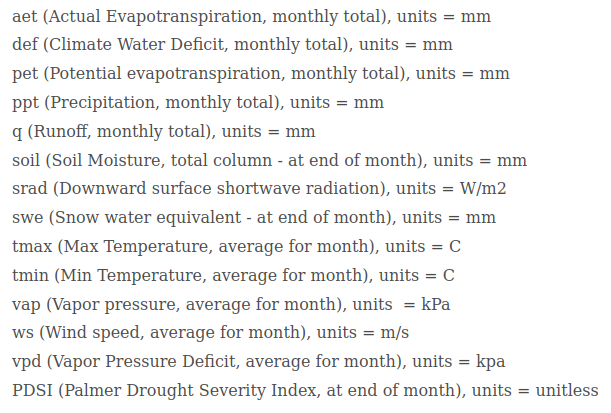
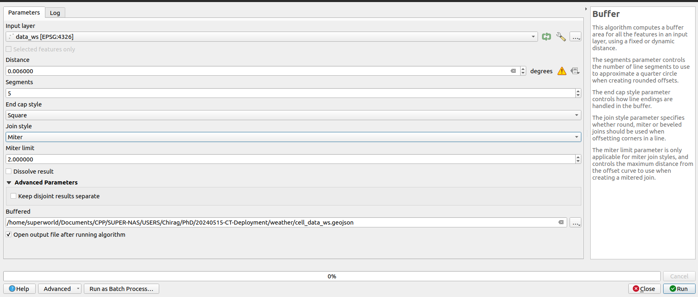

### CT-Deployment 

1. Visual charactisicts
    - RGB - (20cm)
    - Road - (20cm)

2. Environmetal Data
    - climate/ weather data from 202001-202312 - 4 KM 
        - aet, actual evapotranspiration
        - def, climatic water deficit
        - swe, soil water equivalent
        - q, runoff
        - soil, soil moisture
        - PDSI, Palmer Drought Severity Index
        - pet, reference evapotranspiration
        - ppt, precipitation
        - srad, downward shortwave radiation at the surface
        - tmax, maximum air temperature
        - tmin, minimum air temperature
        - vap, vapor pressure
        - vpd, vapor pressure deficit
        - ws, wind speed 

3. Geomorphological data
    - TWI
    - Tree
    - NDVI - (20cm and 3m)
    - Elevation
    - NDWI (Normalized water index) 

 
RGB                     - 128 features (reduced using PCA and components from 25th)

Weather                 - 12 features (normalized and standardized)

NDVI+NDWI+Elevation     - 64 features (auto-encoder feature)
(3 channel)

TWI                     - 32 (auto-encoder feature)
(1 channel)

Total components        - 236 -PCA-> 64 -KNN-> 7 clsuster

All image data = 0.7022365768041495 variance
last 50% image data = 0.1879 variance

+++++++++++++++++++++++++++++++++++++++++++++++++++++++++++++++++++++++++++++++++++++++++++++++++++++++++++++
+++++++++++++++++++++++++++++++++++++++++++++++++++++++++++++++++++++++++++++++++++++++++++++++++++++++++++++
+++++++++++++++++++++++++++++++++++++++++++++++++++++++++++++++++++++++++++++++++++++++++++++++++++++++++++++

1. Weather Data:

    [Terra-Climate](https://www.climatologylab.org/terraclimate.html)

    The weather data is 4km resolution, I downloaded it in 1.3X1 km resolution(GE download resolution). 

    

    Steps:
    1. Convert the points to grid-cell using QGIS>vector>buffer. 

        

2. Elevation:

    

